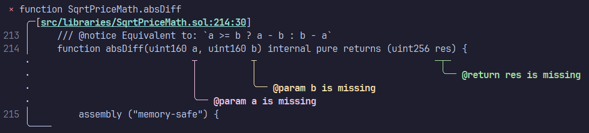

# 🔎 lintspec



<div align="center">
  <a href="https://github.com/beeb/lintspec"></a>
  <a href="https://crates.io/crates/lintspec"></a>
  <a href="https://docs.rs/lintspec/latest/lintspec/"></a>
      <a href="https://docs.rs/lintspec/latest/lintspec/"></a>
</div>

Lintspec is a command-line utility (linter) that checks the completeness and validity of
[NatSpec](https://docs.soliditylang.org/en/latest/natspec-format.html) doc-comments in Solidity code. It is focused on
speed and ergonomics. By default, lintspec will respect gitignore rules when looking for Solidity source files.

Dual-licensed under MIT or Apache 2.0.

## Installation

#### Via `cargo`

```bash
cargo install lintspec
```

#### Via [`cargo-binstall`](https://github.com/cargo-bins/cargo-binstall)

```bash
cargo binstall lintspec
```

#### Via `nix` (coming soon)

```bash
nix-env -iA nixpkgs.lintspec
# or
nix-shell -p lintspec
# or
nix run nixpkgs#lintspec
```

#### Pre-built binaries and install script

Head over to the [releases page](https://github.com/beeb/lintspec/releases)!

## Usage

```
Usage: lintspec [OPTIONS] [PATH]...

Arguments:
  [PATH]...  One or more paths to files and folders to analyze

Options:
  -e, --exclude <EXCLUDE>            Path to a file or folder to exclude (can be used more than once)
  -o, --out <OUT>                    Write output to a file instead of stderr
      --inheritdoc                   Enforce that all public and external items have `@inheritdoc`
      --constructor                  Enforce that constructors have NatSpec
      --enum-params                  Enforce that enums have `@param` for each variant
      --json                         Output diagnostics in JSON format
      --compact                      Compact output
  -h, --help                         Print help (see more with '--help')
  -V, --version                      Print version
```

## Configuration

The tool can be configured with a `.lintspec.toml` file ([see example](./.lintspec.toml)), environment variables
([see example](./.env.example)) or CLI arguments (see above). CLI arguments take precedence over environment variables,
which take precedence over the config file.

## Credits

This tool walks in the footsteps of [natspec-smells](https://github.com/defi-wonderland/natspec-smells), thanks to
them for inspiring this project!

## Comparison with natspec-smells

### Benchmark

On an AMD Ryzen 9 7950X processor with 64GB of RAM, linting the
[Uniswap/v4-core](https://github.com/Uniswap/v4-core) `src` folder on WSL2 (Ubuntu), lintspec is about 214x faster, or
0.46% of the execution time:

```
Benchmark 1: npx @defi-wonderland/natspec-smells --include "src/**/*.sol"
  Time (mean ± σ):     12.484 s ±  0.157 s    [User: 13.581 s, System: 0.594 s]
  Range (min … max):   12.288 s … 12.817 s    10 runs

  Warning: Ignoring non-zero exit code.

Benchmark 2: lintspec src --compact=true
  Time (mean ± σ):      58.2 ms ±   1.3 ms    [User: 264.0 ms, System: 67.9 ms]
  Range (min … max):    53.9 ms …  61.3 ms    50 runs

  Warning: Ignoring non-zero exit code.

Summary
  lintspec src --compact=true ran
  214.55 ± 5.61 times faster than npx @defi-wonderland/natspec-smells --include "src/**/*.sol"
```

### Features

| Feature                         | `lintspec` | `natspec-smells` |
|---------------------------------|------------|------------------|
| Identify missing NatSpec        | ✅          | ✅                |
| Identify duplicate NatSpec      | ✅          | ✅                |
| Include files/folders           | ✅          | ✅                |
| Exclude files/folders           | ✅          | ✅                |
| Enforce usage of `@inheritdoc`  | ✅          | ✅                |
| Enforce NatSpec on constructors | ✅          | ✅                |
| Enforce NatSpec on enums        | ✅          | ❌                |
| Respects gitignore files        | ✅          | ❌                |
| JSON output                     | ✅          | ❌                |
| Pretty output with code excerpt | ✅          | ❌                |
| Output to file                  | ✅          | ❌                |
| Multithreaded                   | ✅          | ❌                |
| No pre-requisites (npm)         | ✅          | ❌                |
